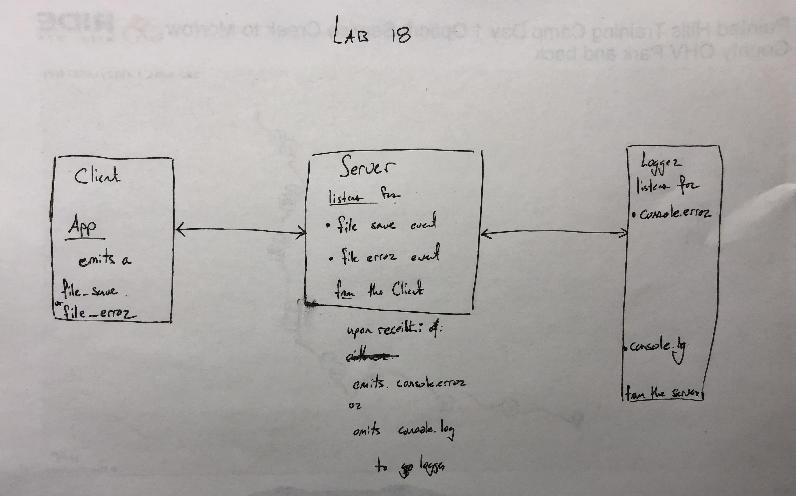

# lab-18 Socket.io

### Author: Matt Wilkin

### Links and Resources
* [Submission PR](https://github.com/mwilkin-401-advanced-javascript/lab-18/pull/1)

* [Travis](https://www.travis-ci.com/mwilkin-401-advanced-javascript/lab-018)

* [UML]

### Documentation

### Dependencies
jest

lint

socket.io

### Modules

server.js

app.js

logger.js

### Setup

Running the app

* In 3 separate terminal windows, run the folling in order:

`node server.js`

`node logger.js`

`node app.js (filename)`

### Tests

How do you run tests?

`npm test`

What assertions were made?
What assertions need to be / should be made?

_________________
_________________

Project Guidelines